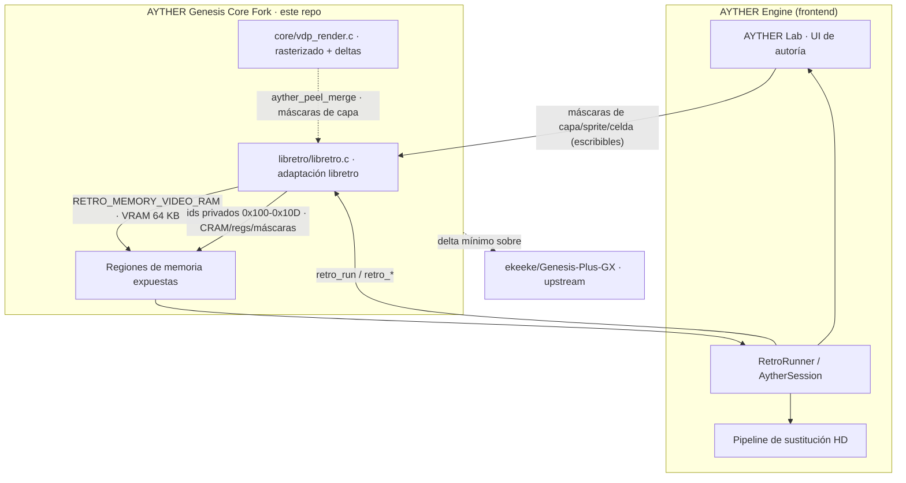

# ⚡ AYTHER Genesis Core Fork

> El core de emulación de **Sega Genesis / Mega Drive** detrás de
> [**AYTHER**](https://github.com/davidlazarte/aether) — un *"RTX Remix para
> juegos 2D retro"*. Este fork mantiene **deltas mínimos** sobre el upstream
> [`ekeeke/Genesis-Plus-GX`](https://github.com/ekeeke/Genesis-Plus-GX),
> exponiendo estado de **VDP, memoria y audio** para que el AYTHER Engine pueda
> sustituir assets en HD de forma **determinista**.
>
> 🔗 **Repositorio público principal de AYTHER:** https://github.com/davidlazarte/aether

---

## My contribution

> **Todo lo de esta sección es mío.** El resto del repositorio (todo lo que está
> por debajo del separador **"Upstream README"**) es **Genesis Plus GX upstream
> sin modificar**. Mis cambios viven en la rama `aether/expose-vram-video-ram` y
> son **deltas quirúrgicos**: la mayoría en `libretro/libretro.c` (la capa de
> adaptación libretro), el rasterizado de capas en `core/vdp_render.c`, y una
> sola extensión del savestate. No toco el núcleo de emulación (CPU, timing,
> mappers, CD): el objetivo es **exponer** estado interno, no alterar la
> emulación.

### Deltas — qué expongo y por qué

| Delta | Qué expone | Dónde | Commit |
|---|---|---|---|
| **VRAM** | `retro_get_memory_data(RETRO_MEMORY_VIDEO_RAM)` → `vram` (64 KB) — upstream devuelve `NULL` | `libretro.c` | `7fcf9bc` |
| **Latch input-hw** | serializa el estado del pad de 6 botones (fase TH) en el savestate (STATE_VERSION 1.7.7) — sin esto, restaurar un savestate a mitad de replay diverge | `state` | `539dc45` |
| **CRAM** | id **privado** `0x100` → `cram` (128 B, 64 colores de 9 bits) | `libretro.c` | `195ebcb` |
| **Registros VDP** | id **privado** `0x101` → `reg[0x20]` (bases de planos + tamaño, para el tilemap viewer) | `libretro.c` | `09dd082` |
| **Máscara de capas** | id **privado** `0x102` (1 byte, **escribible**) → ocultar/mostrar Plano A/B/Window/Sprites en el render (aislar capas para autoría en el Lab) | `vdp_render.c` | _(esta rama)_ |
| **Slots suprimidos** | id **privado** `0x103` (16 bytes, **escribible**) → bitmask de slots SAT que `parse_satb` saltea (ocultar sprite por hash; el frontend lo setea sólo en el frame visible) | `vdp_render.c` | _(esta rama)_ |
| **Celdas suprimidas** | id **privado** `0x104` (512 bytes, **escribible**) → máscara de celdas de tile (64×64, 8 px, coords del frame con bordes); `merge` decide por celda: con primer plano (A/Window) lo **pela** y revela el Plano B de atrás, y si es Plano B puro revela el **backdrop** | `vdp_render.c` | _(esta rama)_ |
| **Deltas adicionales** | ids privados `0x105`–`0x10D`: supresión de tiles de plano, atenuado de capas, captura de sprites parseados (`AytherSpr`), log de escrituras a chips de sonido y mute selectivo por canal de audio | `vdp_render.c` · `sound/` | _(esta rama)_ |

Detalle técnico completo de cada id en
[docs/genesis_plus_gx_libretro.md](docs/genesis_plus_gx_libretro.md).

**Ids privados**: `0x100`–`0x10D` no son estándar de libretro (la convención
reserva ≥`0x100` para usos no estandarizados). El Lab de AYTHER los consume vía
`RetroRunner`/`AytherSession`; un core stock devuelve `null` y el Lab degrada
con gracia (las vistas VRAM/CRAM/tilemap quedan deshabilitadas). **VRAM y CRAM
se exponen word-swapped en hosts little-endian** (igual que la Work RAM): el
byte lógico `off` vive en el array en `off^1`.

### Upstream vs. mío — de un vistazo

| | Upstream (`ekeeke/Genesis-Plus-GX`) | Mío (fork AYTHER) |
|---|---|---|
| Núcleo de emulación (CPU/VDP/audio/CD) | ✅ intacto | — sin cambios |
| `RETRO_MEMORY_VIDEO_RAM` | devuelve `NULL` | expone VRAM (64 KB) |
| Ids de memoria `0x100`–`0x10D` | inexistentes | CRAM, regs VDP, máscaras escribibles, sprites, audio |
| `core/vdp_render.c` | render estándar | + `ayther_peel_merge`, `ayther_layer_mask`, `ayther_*_suppress` |
| Savestate | STATE_VERSION estándar | + latch del pad 6-botones (1.7.7) |
| Branding | Genesis Plus GX | **AYTHER Genesis Core Fork** |

### Integración con AYTHER Engine



### Inspección de VRAM / tilemap

<!-- TODO: dejar la captura o GIF real en docs/ y descomentar esta línea:

-->
> 🖼️ **Captura pendiente.** Guardar la captura o GIF corto de la inspección de
> VRAM/tilemap en `docs/vram-tilemap-inspection.gif` y descomentar la línea de
> arriba. (El asset todavía no está en el repo.)

### Build local

La DLL no se versiona (BYOC). Con un toolchain **llvm-mingw de runtime MSVCRT**
(`scoop install mingw-mstorsjo-llvm-msvcrt`) en el PATH:

```bash
make -f Makefile.libretro platform=win64 -j8
```

Un build UCRT crashea en `retro_load_game` (STATUS_STACK_BUFFER_OVERRUN); el
MSVCRT es bit-idéntico al DLL stock en emulación. La DLL resultante se despliega
en AYTHER como `third_party/cores/genesis_plus_gx_libretro_vram.dll`.

**Rebase con upstream:** revisar que `ekeeke/Genesis-Plus-GX` no haya
implementado `RETRO_MEMORY_VIDEO_RAM` (entraría en conflicto con `7fcf9bc`).

---

## Upstream README (Genesis Plus GX)

[](https://travis-ci.org/libretro/Genesis-Plus-GX)
[](https://ci.appveyor.com/project/bparker06/genesis-plus-gx/branch/master)


Genesis Plus GX is an open-source Sega 8/16 bit emulator focused on accuracy and portability. Initially ported and developped on Gamecube / Wii consoles through [libogc / devkitPPC](http://sourceforge.net/projects/devkitpro/), this emulator is now available on many other platforms through various frontends such as:

* [Retroarch (libretro)](http://www.libretro.com)

* [Bizhawk](http://tasvideos.org/Bizhawk.html)

* [OpenEmu](http://openemu.org/)

----

The source code, initially based on Genesis Plus 1.2a by [Charles MacDonald](http://www.techno-junk.org/ ) has been heavily modified & enhanced, with respect to original goals and design, in order to improve emulation accuracy as well as adding support for new peripherals, cartridge or console hardware and many other exciting [features](https://github.com/ekeeke/Genesis-Plus-GX/blob/master/wiki/Features.md).

The result is that Genesis Plus GX is now more a continuation of the original project than a simple port, providing very accurate emulation and [100% compatibility](https://github.com/ekeeke/Genesis-Plus-GX/blob/master/wiki/Compatibility.md) with Genesis / Mega Drive, Sega/Mega CD, Master System, Game Gear & SG-1000 released software (including all unlicensed or pirate known dumps), also emulating backwards compatibility modes when available. All the people who contributed (directly or indirectly) to this project are listed on the [Credits](https://github.com/ekeeke/Genesis-Plus-GX/blob/master/wiki/Credits.md) page.

----

Multi-platform sourcecode (core), which is made available for use under a specific non-commercial [license](https://github.com/ekeeke/Genesis-Plus-GX/blob/master/LICENSE.txt), is maintained on [Bitbucket](https://bitbucket.org/eke/genesis-plus-gx/src/) / [Github](https://github.com/ekeeke/Genesis-Plus-GX) so that other Genesis Plus ports can benefit of it, as I really wish this emulator becomes a reference for _portable_ and _accurate_ Sega 8/16-bit emulation. If you ported this emulator to other platforms or need help porting it, feel free to contact me.

----

Latest official Gamecube / Wii standalone port (screenshots below) is available [here](https://github.com/ekeeke/Genesis-Plus-GX/tree/master/builds). Be sure to check the included [user manual](https://github.com/ekeeke/Genesis-Plus-GX/blob/master/gx/docs/README.pdf) first. A [startup guide](https://github.com/ekeeke/Genesis-Plus-GX/blob/master/wiki/Getting%20Started.md) and a [FAQ](https://github.com/ekeeke/Genesis-Plus-GX/blob/master/wiki/Frequently%20Asked%20Questions.md) are also available.


----

You can also test latest compiled builds for Gamecube / Wii and Retroarch (Windows 32-bit version only) by downloading them from [here](https://github.com/ekeeke/Genesis-Plus-GX/tree/master/builds).

----

[](https://www.paypal.com/cgi-bin/webscr?cmd=_s-xclick&hosted_button_id=2966212) If you like this project and want to show your appreciation, Paypal donations are always welcomed.
